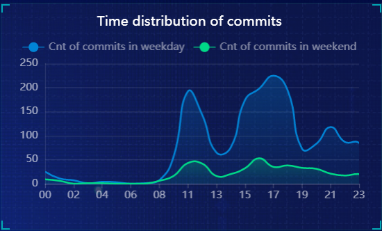
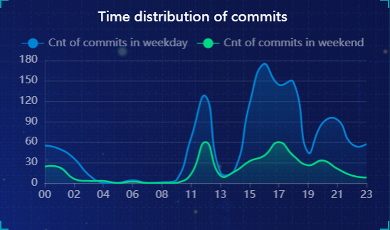
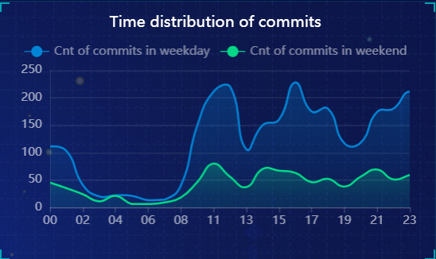

# CS209A-Fall Final Project Report

**作者：12011815余乃蔚，12112319王海龙** 		贡献比：1:1

> You should provide a written report that describes the GitHub repos you selected for this project. 
>
> The written report should also introduce **the architecture design of your project**, as well as the **important classes, fields, and methods**.
>
> Finally, your report should highlight **the insights you obtained from the data analysis results**, e.g., what are **the answers to the above questions**, what can we **learn about the repo according to your answers**, and what can **be improved about this repo**, etc.

我们项目的体系结构设计大概如下：

## 前端部分

使用python+HTML+CSS编写，读取本地txt文件并进行数据展示。


## 后端部分

### 简述

首先是爬虫部分，用的是java编写，结构是普通的maven项目架构，主要是调用github本身的restful接口获取原始的json数据然后使用alibaba的fastjson工具进行解析处理获取到我们想要的数据，第二部分是搭建我们自己的restful接口，这里使用的是springboot的框架，当目录下的application运行后可以直接通过浏览器调用对应的restful接口获取电脑本地的数据,调用的格式为/id/rep/order。


### 选取仓库的原因 ###

选这三个仓库的原因：因为本次project的要求是要获取对应仓库的commit，release，contributors和issues，如果选择较小的仓库可能面临数据量过小或者数据缺失的问题，因此我们决定选取一些较为成熟的仓库，而alibaba作为国内的互联网大厂具有许多成熟的仓库，因此我们这次选取了alibaba的三个仓库分别为fastjson，arthas以及springboot-cloud。


### 关键代码介绍 ###

#### 爬虫部分 ####

**爬虫部分采取的标准的maven的架构，通过github自身的restful接口获取对应的json数据，由于本身的json数据太过繁杂，我们使用了alibaba的fastjson工具对json数据进行了解析，获取到我们所需要的数据。下面以*Commit*为例进行代码分析**

下面这一部分代码用来向github服务器发送**GET**请求获取以获取对应数字，但是我们采取`StringBuilder`将传递过来的json数据存储起来，后面利用`fastjson`工具将其转成`JsonArray`再进行下一步的处理。

  ```java
 String s = "https://api.github.com/repos/lin-xin/vue-manage-system/commits?per_page=100";
    URL url = new URL(s);
    PrintWriter out = new PrintWriter("commits_vue-manage-system.txt");
    PrintWriter out2 = new PrintWriter("Time_vue-manage-system.txt");
    HttpURLConnection connection = (HttpURLConnection) url.openConnection();
    connection.setRequestMethod("GET");
    connection.connect();
  ```

这里遇到的问题是一次请求只能获取一页的内容而一页最多可以存放一百条数据，因此我们采用while循环重复上述操作

```java
while (m != 10) {
      StringBuilder j = new StringBuilder();
      Scanner in = new Scanner(connection.getInputStream());
      while (in.hasNext()) {
        j.append(in.next());
      }
      getCommitList(out2, d, dataList, j.toString());
      s = "https://api.github.com/repos/lin-xin/vue-manage-system/commits?per_page=100&page=" + m;
      url = new URL(s);
      connection = (HttpURLConnection) url.openConnection();
      connection.setRequestMethod("GET");
      connection.connect();
      m++;
    }
```

下面是json处理每一个处理数据的java文件都有一个对应获取`GetJsonList`方法用来处理最先获得的String，这里的数组d用于存储不同时间段的commit天数，*datalist*用来存数据

```java
public static void getCommitList(PrintWriter out, int[] d, List<LinkedHashMap<String, Object>> datalist, String s)
```


先将其String转成`JSONArray` 然后对这个`JSONArray`遍历我们将`JSONArray`的对象中我们想要的数据存进一个`LinkedHashMap` 中最后将`LinkedHashMap`存入datalist中

```java
JSONArray commits = JSONArray.parseArray(s);
```

我们先获得`JSONArray` 中一个对象中的`commit`对象然后获取`commit` 对象中的一个`author`对象，再在`author`对象下获取`name`和`time`对象并对他们进行处理。

```java
JSONObject js  = commits.getJSONObject(i);
JSONObject commit = js.getJSONObject("commit");
JSONObject author = commit.getJSONObject("author");
String name = author.get("name").toString();
String time = author.get("date").toString();
```

我们采用了`simpleformat`类对时间格式进行了处理（原格式是中时区时间）从format转成format1

```java
SimpleDateFormat format = new SimpleDateFormat("yyyy-MM-dd'T'HH:mm:ss Z");
SimpleDateFormat format1 = new SimpleDateFormat("yyyy-MM-dd HH:mm:ss");
```

还利用`calander`类获取对应日期是星期几以获取是工作日还是休息日。

```java
Calendar calendar = Calendar.getInstance();
      calendar.setTime(date);
      int weekday = calendar.get(Calendar.DAY_OF_WEEK);
      if (weekday >= 1 && weekday <= 5) {
        dd = "Weekday";
        d[5]++;
      } else {
        dd = "Weekend";
        d[6]++;
      }
```

最终将datalist的数据写入txt文件当中，其余的三个release，contributors和issues处理思路类似


#### RESTful接口部分

**RESTful**接口部分使用的是springboot的框架，可以通过调用我们的RESTful接口获取对应的json数据，json数据来源于爬虫爬下来的txt文件

通过两个注解`@RestController` 和`@RequestMap` 来标记访问路径例如**fastjson**的**commit**路径为`/alibaba/arthas/release` ，

```java
@RestController
@RequestMapping("/alibaba/arthas/release")
```

用`@GetMaping`注解确定这是GET方法调用的，用一个list存储读取的txt文件，在通过**fastjson**的`toJSONstring`方法转换成**json**格式

```java
@GetMapping
  public String get() {
    ArrayList<String> a = new ArrayList<>();
    while (in.hasNext()) {
      a.add(in.next());
    }
    String js = JSON.toJSONString(a);
    return js;
  }
}
```


## Repo展示部分

我们所选择的Github Repos分别是

1. [alibaba](https://github.com/alibaba)/**[fastjson](https://github.com/alibaba/fastjson)**
2. [alibaba](https://github.com/alibaba)/**[arthas](https://github.com/alibaba/arthas)**
3. [alibaba](https://github.com/alibaba)/**[spring-cloud-alibaba](https://github.com/alibaba/spring-cloud-alibaba)**


对于spring-cloud-alibaba这个repo：

- 它的developer总数为2320，commits前6位的id分别是fangjian0423，mercyblitz，flystar32，yuhuangbin，DanielLiu1123，theonefx。

- 关于issue，open issue的总数为393，closed issue的总数为2570，解决issue的时间的平均值为1074h，极值差为30,026h，方差为9,612,111.

- release的总数为30，最新7代release之间所相差的commits数量分别为0，62，173，129，50，24。其中，关于commit的时间分布如下图所示：

  

从获取的数据中我们可以得知：

- 该repo解决issue的时间跨度较大，小的issue可能几天内就能解决，而大的issue则需要几百天的时间。
- 同时，该repo的developers都比较喜欢在8~12点，14~18点之间内提交commits，在20~22点会有个小高峰，而凌晨至清晨的时间（0点~7点）则几乎没有commits。
- 对于每个releases之间，既有0个commits之差的releases，也有多至173个commits之差的releases，在一定程度上反映出版本之间更新迭代的速度和差别有所区别。
- 根据时间段划分的话，我们把时间段在(6,11]的划分为morning，(11,13]的划分为noon，(13,18]的划分为afternoon，(18,22]的划分为evening，(22,6]（晚22点到次日6点）的划分为night。结果显示，在afternoon时间段的commits是最多的，占比45.48%；其次是morning，占比21.85%。

我们认为，该repo具有足够高的commits数和developers数，但是可能还得在issues的解决这块做出改进，例如说及时关闭已经解决了的issue等；同时，对于每个releases的管理可能也还需加强。


对于arthas这个repo：

- 它的developer总数为1834，commits前6位的id分别是hengyunabc，HollowMan6，kylixs，Hearen，beiwei30，ralf0131。

- 关于issue，open issue的总数为272，closed issue的总数为2051，解决issue的时间的平均值为837h，极值差为31,199h，方差为7,298,297.

- release的总数为47，最新7代release之间所相差的commits数量分别为33，8，16，15，3，12。其中，关于commit的时间分布如下图所示：

  

从获取的数据中我们可以得知：

- 该repo解决issue的时间跨度较大，小的issue可能几天内就能解决，而大的issue则需要几百天的时间。
- 同时，该repo的developers都比较喜欢在9~13点，14~19点之间内提交commits，在20~22点，23~次日3点分别有个小高峰，而凌晨至上午的时间（4点~9点）则几乎没有commits。
- 对于每个releases之间，既有3个commits之差的releases，也有多至33个commits之差的releases，最多的commits之差也仅有33个，反映出版本之间更新迭代的速度较快。
- 根据时间段划分的话，我们把时间段在(6,11]的划分为morning，(11,13]的划分为noon，(13,18]的划分为afternoon，(18,22]的划分为evening，(22,6]（晚22点到次日6点）的划分为night。结果显示，在afternoon时间段的commits是最多的，占比45.01%；其次是evening，占比20.05%。

我们认为，该repo具有足够高的commits数和developers数，但是可能还得在issues的解决这块做出改进，例如说及时关闭已经解决了的issue等。


对于fastjson这个repo：

- 它的developer总数为3971，commits前6位的id分别是wenshao，VictorZeng，Omega-Ariston，'Anonymous'（匿名用户），kimmking，'Anonymous'（匿名用户）。

- 关于issue，open issue的总数为1976，closed issue的总数为2324，解决issue的时间的平均值为1909h，极值差为39,645h，方差为17,971,527.

- release的总数为84，最新7代release之间所相差的commits数量分别为25，68，82，43，56，44。其中，关于commit的时间分布如下图所示：

  

从获取的数据中我们可以得知：

- 该repo解决issue的时间跨度较大，小的issue可能几天内就能解决，而大的issue则需要几百天的时间。
- 同时，该repo的developers都比较喜欢在8~12点，13~19点，20~23点之间内提交commits，在0~2点会有个小高峰，凌晨至清晨的时间（3点~7点）也有少数commits。
- 对于每个releases之间，既有25个commits之差的releases，也有多至82个commits之差的releases，整体来看releases更新迭代的速度和commits之差呈现出较为均衡的趋势。
- 根据时间段划分的话，我们把时间段在(6,11]的划分为morning，(11,13]的划分为noon，(13,18]的划分为afternoon，(18,22]的划分为evening，(22,6]（晚22点到次日6点）的划分为night。结果显示，在afternoon时间段的commits是最多的，占比28.32%；其次是evening，占比23.09%；再者是morning，占比21.7%。

我们认为，该repo具有足够高的commits数和developers数，但是可能还得在issues的解决这块做出改进，例如说及时关闭已经解决了的issue等。同时，在凌晨也会有commits提交，说明developers比较国际化且工作效率都较高，~~但是太晚工作对身体不好。~~


## 总结

通过对alibaba的三个repo的分析，我们体验到对于一个大项目而言，多用户合作来进行工作的形式、提交commit的时段、每多少个commits放出一个release、issue应该何时结束等是什么样的，这对于我们以后管理GitHub项目有一定的参考价值。除此之外我们通过本次项目对springboot项目架构以及RESTful接口有了一个更加深入的认知，学会了应用RESTful接口去爬取数据以及通过springboot框架搭建自己的RESTful接口，以及更熟练的掌握了利用fastjson等工具对json数据进行解析。
